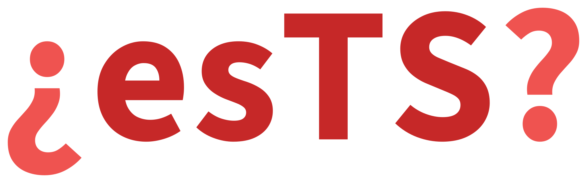

# Spanish Texts Statistics (esTS)



*¿Cómo esTáS, texto?*

**esTS** calcula estadísticas de textos en español: estadísticas básicas, legibilidad, diversidad léxica, complejidad léxica, estilo, fonoestadística, morfología, sintaxis y cohesión, con fórmulas publicadas y con los coeficientes y las escalas de sus autores, y con las categorías, los rasgos y las dependencias de Universal Dependencies.

La biblioteca trabaja tanto con cadenas como con objetos `Doc` de [spaCy](https://github.com/explosion/spaCy); la mayoría de las estadísticas no necesita un modelo entrenado ([Instalación](installation.md#model)). Se puede probar sin instalar en la [demo en Hugging Face Spaces](https://huggingface.co/spaces/SergeyShk/esTS): pegue un texto y obtenga su legibilidad, las métricas, los gráficos y el resaltado de sus fragmentos.

## Funcionalidad

*   construir tokenizadores de [oraciones](extractors/sentences.md), [palabras](extractors/words.md) y [N-gramas de caracteres](extractors/char_ngrams.md) que conocen los signos de apertura, la raya de diálogo y las abreviaturas del español
*   dividir una palabra en [sílabas y hallar su acento](syllables.md) por las reglas ortográficas, sin diccionario
*   calcular [estadísticas básicas del texto](stats/basic_stats.md) (número de oraciones, palabras, letras, sílabas, signos de puntuación por tipo y sus distribuciones)
*   calcular [métricas de legibilidad](stats/readability_stats.md) (Fernández Huerta, Szigriszt-Pazos con la escala INFLESZ, Gutiérrez de Polini, Crawford, Legibilidad µ, SOL, LIX y RIX) con grado de consenso, etapas escolares de España y tiempo de lectura
*   calcular [métricas de diversidad léxica](stats/diversity_stats.md) (Type-Token Ratio y sus variantes, MATTR, MSTTR, Measure of Textual Lexical Diversity, HD-D, los índices de Simpson y de Yule, la entropía, las leyes de Zipf y de Heaps), sobre todo el texto o por ventanas con intervalos de confianza
*   calcular [estadísticas morfológicas](stats/morph_stats.md) sobre Universal Dependencies (categorías gramaticales y quince rasgos morfológicos) con los marcadores del español: los modos, las formas no personales, las cópulas `ser` y `estar`, los adverbios en `-mente`
*   calcular [estadísticas sintácticas](stats/syntax_stats.md) sobre el árbol de dependencias (distancias, profundidad, cláusulas, coordinación) con las construcciones del estilo administrativo: la pasiva con `ser` y con `se`, las cláusulas de participio y de gerundio, las cadenas de `de`, los predicados escindidos
*   calcular [estadísticas de cohesión](stats/cohesion_stats.md) a la manera de Coh-Metrix (repetición de sustantivos, argumentos y palabras con contenido entre oraciones, información dada, cohesión temporal) con la densidad de 250 marcadores del discurso por clase
*   calcular [estadísticas de complejidad léxica](stats/lexical_stats.md) a la manera de TAALES: cuán raras son las palabras de un texto según un [diccionario de frecuencias](datasets/freqdict.md) de Google Books Ngram (frecuencia, rango, dispersión, sorpresa) y según las bandas de frecuencia del top-1000 al 10000, con la densidad léxica
*   calcular [métricas de estilo](stats/style_stats.md): los indicadores SEO de Advego y Text.ru (náusea, contenido de agua, índice de spam, naturalidad según Zipf, densidad de palabras clave) y los marcadores del estilo burocrático según las guías españolas de lenguaje claro - sustantivos deverbales, locuciones prepositivas, expresiones parentéticas y clichés
*   calcular la [fonoestadística](stats/phon_stats.md) sobre los sonidos de una transcripción por reglas: proporciones de las clases de sonidos, grupos consonánticos, hiatos, sílabas abiertas, dureza e índices de aliteración y de asonancia
*   escandir el [verso](stats/verse_stats.md) por su metro silábico: las sílabas métricas, el metro de un poema, el perfil acentual y los tipos del endecasílabo, la rima consonante y asonante con su esquema, las estrofas y la forma de un poema
*   comparar corpus con las medidas de la lingüística de corpus: [palabras clave](corpus/keyness.md) frente a un corpus de referencia o al diccionario de frecuencias, [colocaciones](corpus/collocations.md), la [dispersión](corpus/dispersion.md) de una palabra por las partes de un texto y una [concordancia KWIC](corpus/kwic.md), y atribuir la autoría por [estilometría](corpus/stylometry.md): la Delta de Burrows, Zeta, la curva de Mendenhall, las palabras funcionales; encontrar los rasgos que distinguen dos corpus [comparándolos](corpus/compare.md) por 132 rasgos de un texto
*   visualizar textos y corpus: la [ley de Zipf](visualizers/zipf.md), la [huella literaria](visualizers/fingerprinting.md), un [árbol de palabras](visualizers/word_tree.md), gráficos [de corpus](visualizers/corpus.md) y [estilométricos](visualizers/stylometry.md), el [crecimiento del vocabulario](visualizers/vocabulary.md), las [longitudes de las oraciones](visualizers/sentences.md) y el [resaltado del texto](visualizers/highlight.md) por los fragmentos que cuentan las estadísticas
*   añadir las estadísticas a un [pipeline de spaCy](components.md) como componentes, de modo que el texto se anote y se mida en una sola pasada y las estadísticas viajen con el `Doc`
*   trabajar con un [corpus de literatura en español](datasets/spanishliterature.md) de dominio público (150 obras de 33 autores en cuatro géneros), una [colección de sonetos](datasets/spanishsonnets.md) de los siglos XV-XX con el patrón métrico y la rima de cada verso, y un [diccionario de frecuencias](datasets/freqdict.md) de 83 785 lemas según Google Books Ngram

## Instalación

Se requiere Python 3.11 o superior.

``` bash
pip install pyests
```

El distribuible en PyPI se llama `pyests` y el paquete que instala es `ests`. Las dependencias, el modelo de spaCy y los conjuntos de datos están en la página de [Instalación](installation.md).

## Primeros pasos

``` python
>>> from ests import BasicStats, DiversityStats, ReadabilityStats

>>> text = "Hay tres clases de mentiras: mentiras, malditas mentiras y estadísticas"

>>> BasicStats(text).get_stats()
{'c_letters': {1: 1, 2: 1, 3: 1, 4: 1, 6: 1, 8: 4, 12: 1},
 'c_syllables': {1: 4, 2: 1, 3: 4, 5: 1},
 'n_sents': 1,
 'n_words': 10,
 'n_unique_words': 8,
 'n_long_words': 5,
 'n_complex_words': 5,
 'n_simple_words': 5,
 'n_monosyllable_words': 4,
 'n_polysyllable_words': 6,
 'n_chars': 71,
 'n_letters': 60,
 'n_spaces': 9,
 'n_syllables': 23,
 'n_punctuations': 2,
 'c_punctuations': {'comma': 1, 'period': 0, 'question': 0, 'exclamation': 0,
                    'ellipsis': 0, 'colon': 1, 'semicolon': 0, 'dash': 0,
                    'hyphen': 0, 'angle_quotes': 0, 'straight_quotes': 0,
                    'parentheses': 0, 'other': 0}}

>>> ReadabilityStats(text).flesch_reading_easy
53.545000000000016

>>> DiversityStats(text).ttr
0.8
```

Cualquier estadística puede mostrarse en forma legible:

``` python
>>> BasicStats(text).print_stats()
     Statistic      |  Value
------------------------------
Sentences           |    1
Words               |    10
Unique words        |    8
Long words          |    5
Complex words       |    5
Simple words        |    5
Monosyllabic words  |    4
Polysyllabic words  |    6
Characters          |    71
Letters             |    60
Spaces              |    9
Syllables           |    23
Punctuation marks   |    2
```

??? note "Estructura del proyecto"

    *   **demo** - la demo en Hugging Face Spaces (Gradio)
    *   **docs** - documentación del proyecto
    *   **ests**:
        *   basic_stats.py - estadísticas básicas del texto del núcleo anyTS con las sílabas del español
        *   cohesion_stats.py - estadísticas de cohesión
        *   lexical_stats.py - estadísticas de complejidad léxica
        *   components.py - componentes de un pipeline de spaCy
        *   corpus - medidas de la lingüística de corpus: palabras clave, colocaciones, dispersión, concordancia, estilometría, comparación de corpus
        *   datasets - conjuntos de datos: literatura en español, sonetos en español, diccionario de frecuencias
        *   constants.py - constantes de la lengua española y de las métricas
        *   diversity_stats.py - métricas de diversidad léxica del núcleo anyTS sobre una cadena o un Doc
        *   exceptions.py - excepciones de la biblioteca
        *   extractors.py - los extractores del núcleo anyTS con los tokenizadores del español
        *   morph_stats.py - estadísticas morfológicas
        *   readability_stats.py - métricas de legibilidad: las fórmulas del español sobre las del núcleo anyTS
        *   style_stats.py - métricas de estilo
        *   phon_stats.py - fonoestadística
        *   syntax_stats.py - estadísticas sintácticas
        *   verse_stats.py - estadísticas del verso
        *   syllables.py - silabificación y acento
        *   utils.py - herramientas auxiliares
        *   visualizers - gráficos: ley de Zipf, huella literaria, árbol de palabras, gráficos de corpus y estilométricos, crecimiento del vocabulario, longitudes de las oraciones, resaltado del texto
    *   **scripts** - scripts que construyen los archivos de los conjuntos de datos y traen las páginas de anyTS de la documentación
    *   **tests** - pruebas que reproducen la estructura del paquete
