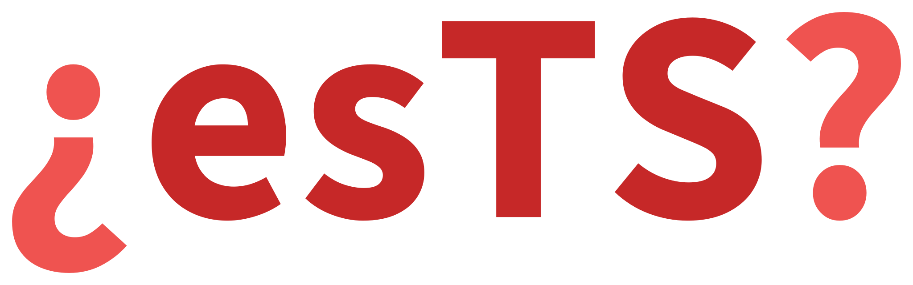

# Spanish Texts Statistics (esTS)



*¿Cómo esTáS, texto?*

**esTS** computes for Spanish texts what usually requires assembling several separate tools: basic statistics, readability, lexical diversity, morphology, syntax and cohesion - by published formulas with the coefficients and the scales of their authors, and by the parts of speech, the features and the dependencies of Universal Dependencies.

The library works both with raw strings and with `Doc` objects of [spaCy](https://github.com/explosion/spaCy), and only the morphological, the syntactic and the cohesion statistics need a trained model: sentences, words and character N-grams are extracted by rules, syllables and stress follow from the orthography.

## Features

*   build tokenizers for [sentences](extractors/sentences.md), [words](extractors/words.md) and [character N-grams](extractors/char_ngrams.md) that know the inverted marks, the dialogue dash and the abbreviations of Spanish
*   divide a word into [syllables and find its stress](syllables.md) by the orthographic rules, with no dictionary
*   compute [basic text statistics](stats/basic_stats.md) (numbers of sentences, words, letters, syllables, punctuation marks by type and their distributions)
*   compute [readability metrics](stats/readability_stats.md) (Fernández Huerta, Szigriszt-Pazos with the INFLESZ scale, Gutiérrez de Polini, Crawford, Legibilidad µ, SOL, LIX and RIX) with a consensus grade, the school stages of Spain and reading time
*   compute [lexical diversity metrics](stats/diversity_stats.md) (Type-Token Ratio and its variations, MATTR, MSTTR, Measure of Textual Lexical Diversity, HD-D, the indices of Simpson and Yule, entropy, the laws of Zipf and Heaps), over the whole text or over windows with confidence intervals
*   compute [morphological statistics](stats/morph_stats.md) on Universal Dependencies (parts of speech and fifteen grammatical features) with the markers of Spanish: the moods, the non-finite forms, the copulas `ser` and `estar`, the adverbs in `-mente`
*   compute [syntactic statistics](stats/syntax_stats.md) on the dependency tree (dependency distances, depth, clauses, coordination) with the constructions of the administrative style: the passive with `ser` and with `se`, the participial and the gerund clauses, the chains of `de`, the split predicates
*   compute [cohesion statistics](stats/cohesion_stats.md) in the manner of Coh-Metrix (the overlap of nouns, arguments and content words between sentences, givenness, temporal cohesion) with the density of 255 Spanish discourse markers by class
*   compare corpora with the measures of corpus linguistics: [keywords](corpus/keyness.md) against a reference corpus, [collocations](corpus/collocations.md), the [dispersion](corpus/dispersion.md) of a word over the parts of a text and a [KWIC concordance](corpus/kwic.md), and attribute authorship by [stylometry](corpus/stylometry.md): Burrows's Delta, Zeta, the Mendenhall curve, the function words; find the features that tell two corpora apart by [comparing](corpus/compare.md) them over 132 features of a text
*   visualize texts and corpora: [Zipf's law](visualizers/zipf.md), [literature fingerprinting](visualizers/fingerprinting.md), a [word tree](visualizers/word_tree.md), [corpus](visualizers/corpus.md) and [stylometric](visualizers/stylometry.md) plots, [vocabulary growth](visualizers/vocabulary.md) and [sentence lengths](visualizers/sentences.md)
*   add the statistics to a [spaCy pipeline](components.md) as components, so that a text is annotated and measured in one pass and the statistics travel with the `Doc`

Lexical sophistication and the first datasets complete 0.3; style, phonostatistics, metre and rhyme come in 0.4.

## Installation

Requires Python 3.11 or newer.

``` bash
pip install pyests
```

The distribution on PyPI is `pyests`, the package it installs is `ests`. More on dependencies and installing from the repository - on the [Installation](installation.md) page.

## Quick start

``` python
>>> from ests import BasicStats, DiversityStats, ReadabilityStats

>>> text = "Hay tres clases de mentiras: mentiras, malditas mentiras y estadísticas"

>>> BasicStats(text).get_stats()
{'c_letters': {1: 1, 2: 1, 3: 1, 4: 1, 6: 1, 8: 4, 12: 1},
 'c_syllables': {1: 4, 2: 1, 3: 4, 5: 1},
 'n_sents': 1,
 'n_words': 10,
 'n_unique_words': 8,
 'n_long_words': 5,
 'n_complex_words': 5,
 'n_simple_words': 5,
 'n_monosyllable_words': 4,
 'n_polysyllable_words': 6,
 'n_chars': 71,
 'n_letters': 60,
 'n_spaces': 9,
 'n_syllables': 23,
 'n_punctuations': 2,
 'c_punctuations': {'comma': 1, 'period': 0, 'question': 0, 'exclamation': 0,
                    'ellipsis': 0, 'colon': 1, 'semicolon': 0, 'dash': 0,
                    'hyphen': 0, 'angle_quotes': 0, 'straight_quotes': 0,
                    'parentheses': 0, 'other': 0}}

>>> ReadabilityStats(text).flesch_reading_easy
53.545000000000016

>>> DiversityStats(text).ttr
0.8
```

Any statistic can be printed in a readable form:

``` python
>>> BasicStats(text).print_stats()
     Statistic      |  Value
------------------------------
Sentences           |    1
Words               |    10
Unique words        |    8
Long words          |    5
Complex words       |    5
Simple words        |    5
Monosyllabic words  |    4
Polysyllabic words  |    6
Characters          |    71
Letters             |    60
Spaces              |    9
Syllables           |    23
Punctuation marks   |    2
```

??? note "Project structure"

    *   **docs** - project documentation
    *   **ests**:
        *   basic_stats.py - basic text statistics
        *   cohesion_stats.py - cohesion statistics
        *   components.py - components of a spaCy pipeline
        *   corpus - measures of corpus linguistics: keywords, collocations, dispersion, concordance, stylometry, comparison of corpora
        *   constants.py - constants of the Spanish language and of the metrics
        *   diversity_stats.py - lexical diversity metrics
        *   exceptions.py - library exceptions
        *   extractors.py - tools for object extraction from a text
        *   morph_stats.py - morphological statistics
        *   readability_stats.py - readability metrics
        *   syntax_stats.py - syntactic statistics
        *   syllables.py - syllabification and stress
        *   utils.py - helper tools
        *   visualizers - plots: Zipf's law, fingerprinting, word tree, corpus and stylometric plots, vocabulary growth, sentence lengths
    *   **tests** - tests mirroring the package structure
