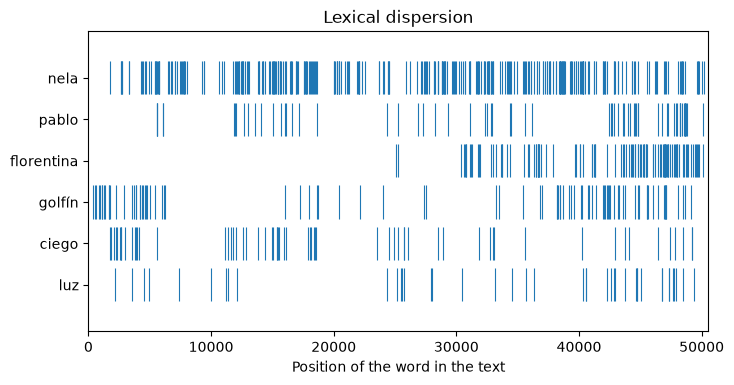
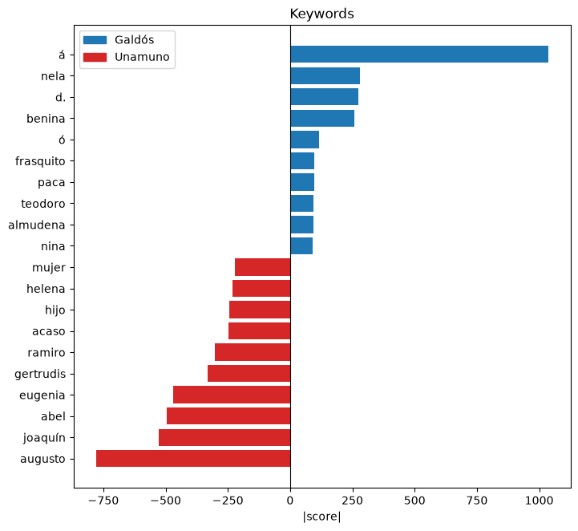
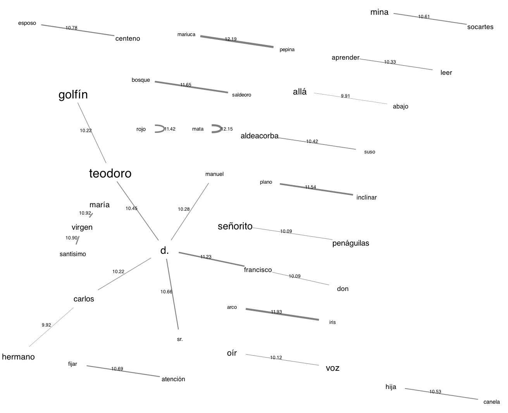

# Gráficos de corpus

!!! info ""
    **ests.visualizers.dispersion_plot()**, **ests.visualizers.keyness_plot()**, **ests.visualizers.collocation_network()**

## Descripción

Gráficos para las [medidas de corpus](../corpus/keyness.md): la dispersión léxica - dónde aparece una palabra en un texto -, un diagrama de las palabras clave que encuentra [`keyness`](../corpus/keyness.md) y una red de las colocaciones que encuentra [`collocations`](../corpus/collocations.md). Las funciones de matplotlib reciben los ejes `ax` y devuelven `Axes`: sin `ax` se crea una figura nueva, con ellos el gráfico va a una rejilla propia; la red de colocaciones la construye graphviz y devuelve un `Graph`, como el [árbol de palabras](word_tree.md) devuelve un `Digraph`.

Las funciones son las del núcleo [anyTS](https://sergeyshk.github.io/anyTS/visualizers/corpus/). Las etiquetas por defecto de los gráficos de matplotlib son las inglesas de `VISUALIZER_LABELS` en `anyts.constants`; `labels` sustituye cualquiera de ellas.

## Dispersión léxica { #dispersion_plot }

<!-- core: visualizers/corpus.md:dispersion_plot 604b589 -->
Una fila por cada palabra de `targets` y una marca en la posición de cada una de sus apariciones en el texto. Las palabras se comparan tal cual: las mayúsculas y minúsculas y la lematización corresponden a la extracción de las palabras.

| Parámetro | Tipo | Por defecto | Descripción |
| :-------: | :--: | :---------: | :---------: |
| `words` | list[str] | `-` | Palabras del texto en orden |
| `targets` | list[str] | `-` | Palabras cuyas apariciones se muestran |
| `ax` | Axes | `None` | Ejes para el gráfico |
| `labels` | dict[str, str] | `None` | Etiquetas sobre las de por defecto: `title`, `xlabel` |

Las palabras las extrae [`WordsExtractor`](../extractors/words.md): en minúsculas con `lowercase=True`, los lemas con `use_lexemes=True`.

## Diagrama de palabras clave { #keyness_plot }

<!-- core: visualizers/corpus.md:keyness_plot e860f91 -->
Barras horizontales divergentes: las palabras de `positive` a la derecha, las de `negative` - el resultado de `keyness` con `positive=False` - a la izquierda; la longitud de una barra es el valor absoluto del campo `field` (`score`, `g2`, `log_ratio`), así que el lado lo fija la lista y no el signo de la medida; `top_n` palabras por lado, y las palabras con un valor indefinido o infinito se omiten. Para la razón de momios (`score` de 0 a infinito, uno - momios iguales) indique `log=True`: se representa el valor absoluto de $\log_2$ del valor, simétrico en torno a uno.

| Parámetro | Tipo | Por defecto | Descripción |
| :-------: | :--: | :---------: | :---------: |
| `positive` | list[Keyword] | `-` | Palabras clave positivas |
| `negative` | list[Keyword] | `()` | Palabras clave negativas |
| `top_n` | int | `20` | Número de palabras por lado |
| `labels` | dict[str, str]/tuple[str, str] | `None` | Etiquetas sobre las de por defecto: `title`, `xlabel` y `xlabel_log` (cadenas de formato con `field`), `target` y `reference` (la leyenda); un par de cadenas fija solo la leyenda |
| `field` | str | `score` | Campo de `Keyword` cuyos valores se representan |
| `log` | bool | `False` | Representar $\log_2$ del valor, para la razón de momios |
| `ax` | Axes | `None` | Ejes para el gráfico |

## Red de colocaciones { #collocation_network }

<!-- core: visualizers/corpus.md:collocation_network 080cdcf -->
Un grafo no dirigido: los nodos son las palabras con el tamaño de la letra según su frecuencia, las aristas son los pares con el grosor y la etiqueta según el valor de la medida; la disposición `neato`. Un par de una palabra consigo misma - una palabra repetida dentro de la ventana - sería un bucle y se deja fuera antes de tomar los `top_n` pares. Para dibujarlo hacen falta los ejecutables de [Graphviz](https://graphviz.org/download/); en Jupyter el grafo se muestra solo, y `graph.render("network")` guarda un archivo png.

| Parámetro | Tipo | Por defecto | Descripción |
| :-------: | :--: | :---------: | :---------: |
| `collocations` | list[Collocation] | `-` | Colocaciones |
| `top_n` | int | `None` | Número de pares desde el principio de la lista; `None` - todos |

## Ejemplo de uso

*Marianela* de Galdós y seis novelas del [corpus de literatura](../datasets/spanishliterature.md): *Marianela*, *Misericordia* y *Torquemada en la hoguera* frente a *Niebla*, *Abel Sánchez* y *La tía Tula* de Unamuno.

!!! example "Ejemplo"

    _Código_:

    ``` python
    from spacy.lang.es.stop_words import STOP_WORDS

    from ests import WordsExtractor
    from ests.corpus import collocations, keyness
    from ests.datasets import SpanishLiterature
    from ests.visualizers import collocation_network, dispersion_plot, keyness_plot

    sl = SpanishLiterature()
    sl.download()
    titles = (
        "Marianela",
        "Misericordia",
        "Torquemada en la hoguera",
        "Niebla",
        "Abel Sánchez",
        "La tía Tula",
    )
    novels = {
        record["title"]: record["text"]
        for author in ("galdos", "unamuno")
        for record in sl.get_records(author=author)
        if record["title"] in titles
    }

    # Dónde aparecen los personajes y los motivos de Marianela
    words = WordsExtractor(lowercase=True).extract(novels["Marianela"])
    dispersion_plot(words, ["nela", "pablo", "florentina", "golfín", "ciego", "luz"])

    # Palabras clave de Galdós frente a Unamuno, lemas sin palabras vacías
    we = WordsExtractor(use_lexemes=True, lowercase=True, filter_nums=True, stopwords=STOP_WORDS)
    galdos = [lemma for title in titles[:3] for lemma in we.extract(novels[title])]
    unamuno = [lemma for title in titles[3:] for lemma in we.extract(novels[title])]
    keyness_plot(
        keyness(galdos, unamuno, min_freq=5, top_n=10),
        keyness(galdos, unamuno, positive=False, min_freq=5, top_n=10),
        labels=("Galdós", "Unamuno"),
    )

    # Red de colocaciones de Marianela
    graph = collocation_network(
        collocations(we.extract(novels["Marianela"]), window=3, min_freq=5, top_n=25)
    )
    graph.render("network", format="png")
    ```

    _Resultado_:

    {: .center }

    {: .center }

    {: .center }

Nela recorre toda la novela, Florentina entra en su segunda mitad, y el doctor Golfín la abre y la cierra; la ceguera de Pablo (`ciego`) pertenece sobre todo a la primera mitad. Además de los nombres de los personajes, las palabras clave muestran la ortografía antigua de las ediciones (`á`, `fué`) y palabras de los temas de Unamuno: `acaso`, `hijo`. La red de colocaciones reúne los nombres y los lugares de *Marianela* en torno a `d.`, el *don* abreviado: Teodoro Golfín, Aldeacorba de Suso, las minas de Socartes.
