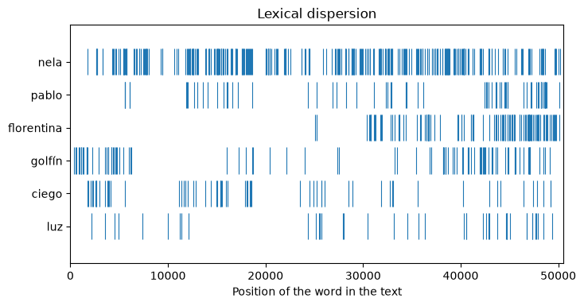
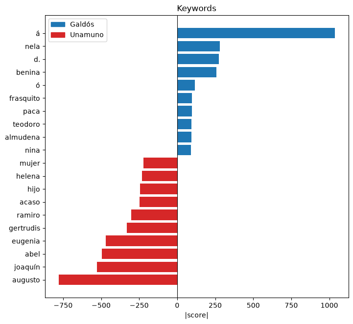
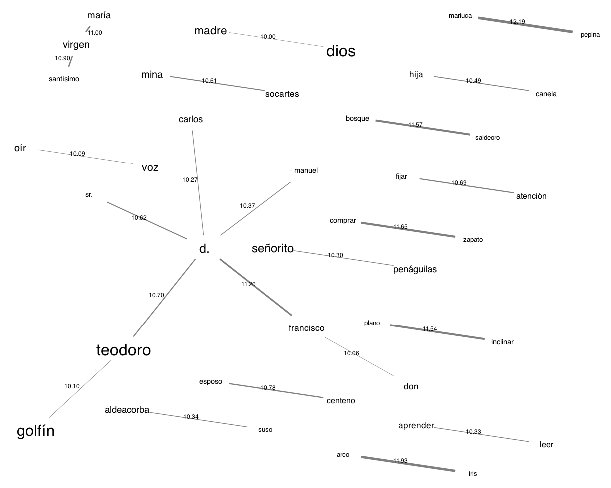

# Corpus plots

!!! info ""
    **ests.visualizers.dispersion_plot()**, **ests.visualizers.keyness_plot()**, **ests.visualizers.collocation_network()**

## Description

Plots for the [corpus measures](../corpus/keyness.md): the lexical dispersion - where in a text a word occurs, a chart of the keywords found by [`keyness`](../corpus/keyness.md) and a network of the collocations found by [`collocations`](../corpus/collocations.md). The matplotlib functions take the axes `ax` and return `Axes`: without `ax` a new figure is created, with it the plot goes into a grid of one's own; the network of collocations is built by graphviz and returns a `Graph`, as the [word tree](word_tree.md).

## Lexical dispersion { #dispersion_plot }

A row for every word of `targets` and a tick at the position of each of its occurrences in the text, as `dispersion_plot` of NLTK and `textplot_xray` of quanteda. Words are compared as they are: case and lemmatization belong to [`WordsExtractor`](../extractors/words.md), and lemmas are looked for with `use_lexemes=True`.

| Parameter | Type | Default | Description |
| :-------: | :--: | :-----: | :---------: |
| `words` | list[str] | `-` | Words of the text in order |
| `targets` | list[str] | `-` | Words whose occurrences are shown |
| `ax` | Axes | `None` | Axes for the plot |

## Chart of keywords { #keyness_plot }

Diverging horizontal bars (`textplot_keyness` of quanteda): the words of `positive` to the right, of `negative` - the result of `keyness` with `positive=False` - to the left, the length of a bar is the absolute value of the `field` (`score`, `g2`, `log_ratio`), so the side is set by the list and not by the sign of the measure; `top_n` words on each side, the words with an undefined or infinite value are skipped. For the odds ratio (`score` from 0 to infinity, one - equal odds) set `log=True`: the absolute $\log_2$ of the value is plotted, symmetric around one.

| Parameter | Type | Default | Description |
| :-------: | :--: | :-----: | :---------: |
| `positive` | list[Keyword] | `-` | Positive keywords |
| `negative` | list[Keyword] | `()` | Negative keywords |
| `top_n` | int | `20` | Number of words on each side |
| `labels` | tuple[str, str] | `("target corpus", "reference corpus")` | Labels of the legend |
| `field` | str | `score` | Field of `Keyword` whose values are plotted |
| `log` | bool | `False` | Plot $\log_2$ of the value - for the odds ratio |
| `ax` | Axes | `None` | Axes for the plot |

## Network of collocations { #collocation_network }

An undirected graph (`textplot_network` of quanteda): the nodes are the words with the size of the font by frequency, the edges the pairs with the width and the label by the value of the measure; the `neato` layout. A pair of a word with itself - a word repeated within the window (`rojo rojo`) - would be a loop and is left out before `top_n` pairs are taken. Rendering needs the executables of [Graphviz](https://graphviz.org/download/); in Jupyter the graph displays itself, and `graph.render("network")` saves a png file, as for the word tree.

| Parameter | Type | Default | Description |
| :-------: | :--: | :-----: | :---------: |
| `collocations` | list[Collocation] | `-` | Collocations |
| `top_n` | int | `None` | Number of pairs from the start of the list; `None` - all of them |

## Usage example

*Marianela* by Galdós and six novels from the [corpus of literature](../datasets/spanishliterature.md): *Marianela*, *Misericordia* and *Torquemada en la hoguera* against *Niebla*, *Abel Sánchez* and *La tía Tula* by Unamuno.

!!! example "Example"

    _Code_:

    ``` python
    from spacy.lang.es.stop_words import STOP_WORDS

    from ests import WordsExtractor
    from ests.corpus import collocations, keyness
    from ests.datasets import SpanishLiterature
    from ests.visualizers import collocation_network, dispersion_plot, keyness_plot

    sl = SpanishLiterature()
    sl.download()
    titles = (
        "Marianela",
        "Misericordia",
        "Torquemada en la hoguera",
        "Niebla",
        "Abel Sánchez",
        "La tía Tula",
    )
    novels = {
        record["title"]: record["text"]
        for author in ("galdos", "unamuno")
        for record in sl.get_records(author=author)
        if record["title"] in titles
    }

    # Where the characters and the motifs of Marianela occur
    words = WordsExtractor(lowercase=True).extract(novels["Marianela"])
    dispersion_plot(words, ["nela", "pablo", "florentina", "golfín", "ciego", "luz"])

    # Keywords of Galdós against Unamuno, lemmas without stop words
    we = WordsExtractor(use_lexemes=True, lowercase=True, filter_nums=True, stopwords=STOP_WORDS)
    galdos = [lemma for title in titles[:3] for lemma in we.extract(novels[title])]
    unamuno = [lemma for title in titles[3:] for lemma in we.extract(novels[title])]
    keyness_plot(
        keyness(galdos, unamuno, min_freq=5, top_n=10),
        keyness(galdos, unamuno, positive=False, min_freq=5, top_n=10),
        labels=("Galdós", "Unamuno"),
    )

    # Network of collocations of Marianela
    graph = collocation_network(
        collocations(we.extract(novels["Marianela"]), window=3, min_freq=5, top_n=25)
    )
    graph.render("network", format="png")
    ```

    _Result_:

    {: .center }

    {: .center }

    {: .center }

Nela runs through the whole novel, Florentina enters in its second half, and the doctor Golfín opens and closes it; the blindness of Pablo (`ciego`) belongs mostly to the first half. Beside the names of the characters, the keywords show the spelling of the editions - `á` with the accent of the old orthography, which of the novels of Galdós only the edition of *Torquemada en la hoguera* keeps, and `fué`, which all three editions of Unamuno keep - and words of the themes of Unamuno: `acaso`, `hijo`. The network of collocations gathers the names and the places of *Marianela* around `d.`, the abbreviated *don*: Teodoro Golfín, Aldeacorba de Suso, the mines of Socartes.
