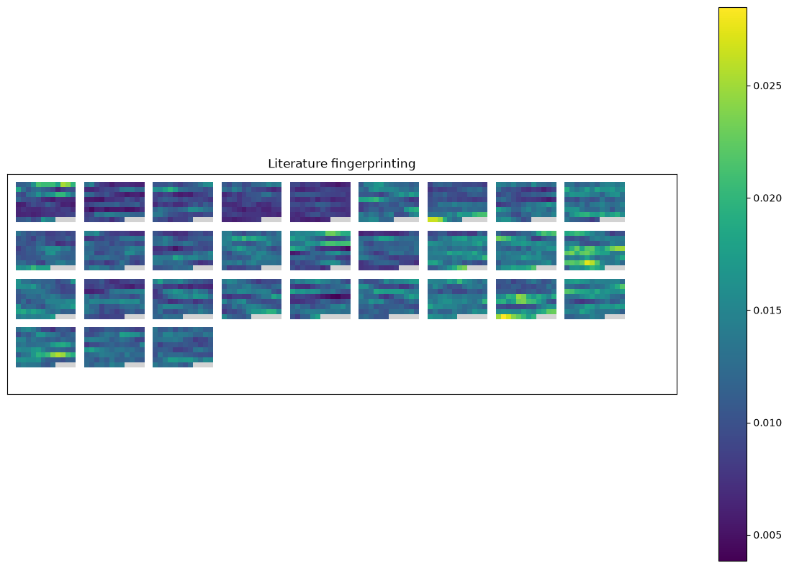

# Literature fingerprinting

!!! info ""
    **ests.visualizers.fingerprinting()**

## Description

Visualization of literature fingerprinting.

!!! note "Note"
    Literature fingerprinting is described in detail in this [paper](https://www.uni-konstanz.de/mmsp/pubsys/publishedFiles/KeOe07.pdf).

Every text is cut into segments of `segment_len` words with a sliding step of a tenth of a segment, and a measure of lexical diversity is computed for every segment. A text is a block of squares in the order of its segments, row by row, 8 rows high, or a single column when it has at most 8 segments; a block wider than a row of the drawing area wraps into rows of that width. The blocks are laid out left to right and wrap between the rows of an area `2 · x_size` wide, which grows downwards from `2 · y_size` when they need more height, so nothing is cut off. The colour of a square is the value of the measure on the scale of the colorbar, from its smallest to its greatest finite value over all the texts; the default map is sequential, since the middle of a measure means nothing. Segments where the measure is undefined (`nan` on segments too short for it) and the empty cells of a block are light grey, apart from every value, zero included.

## Parameters

| Parameter | Type | Default | Description |
| :-------: | :--: | :-----: | :---------: |
| `texts` | list[list[str]] | `-` | List of lists of words |
| `segment_len` | int | `10` | Size of a segment |
| `metric` | Callable | `None` | Function of a measure of [lexical diversity](../stats/diversity_stats.md); `calc_ttr` by default |
| `x_size` | int | `800` | Half the width of the drawing area |
| `y_size` | int | `600` | Half the height of the drawing area, which grows when the blocks need more |
| `cmap` | str | `'viridis'` | Colour map |
| `ax` | Axes | `None` | Axes of matplotlib for the plot; if not given, a 15×10 figure is created |

The function returns the `Axes` with the visualization, set to an equal aspect so that the squares stay square; the figure is `ax.figure`.

## Usage example

The first five windows of 1000 words of six novels from [Project Gutenberg](https://www.gutenberg.org), three by Galdós and three by Unamuno, by Simpson's index.

!!! example "Example"

    _Code_:

    ``` python
    from urllib.request import urlopen

    from ests import WordsExtractor
    from ests.corpus import split_windows
    from ests.diversity_stats import calc_simpson_index
    from ests.visualizers import fingerprinting


    def gutenberg(number):
        url = f"https://www.gutenberg.org/cache/epub/{number}/pg{number}.txt"
        text = urlopen(url).read().decode("utf-8")
        start = text.index("\n", text.index("*** START OF"))
        return text[start : text.index("*** END OF")]


    we = WordsExtractor(lowercase=True)
    texts = [
        we.extract(window)
        for number in (17340, 21831, 15206, 49836, 44512, 44358)
        for window in split_windows(gutenberg(number), 1000)[:5]
    ]
    fingerprinting(texts, segment_len=100, metric=calc_simpson_index, x_size=1000, y_size=330)
    ```

    _Result_:

    {: .center }

The first fifteen blocks are Galdós, the last fifteen Unamuno. Simpson's index - the probability that two words drawn at random are the same - is lower in Galdós (a median of 0.0107 against 0.0127 over the segments), so his blocks are darker and Unamuno's, who repeats his words more, greener.
