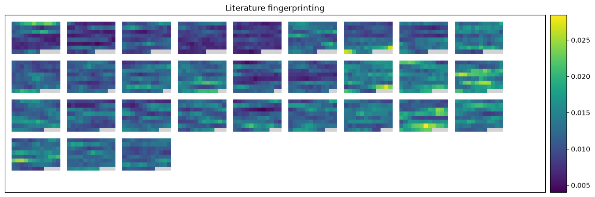

# Literature fingerprinting

!!! info ""
    **ests.visualizers.fingerprinting()**

## Description

--8<-- "visualizers/fingerprinting.md:fingerprinting"

The function is that of the [anyTS](https://sergeyshk.github.io/anyTS/visualizers/fingerprinting/) core; the measures of [lexical diversity](../stats/diversity_stats.md) of esTS, functions of a list of words such as `calc_ttr` or `calc_simpson_index`, serve as the `metric`. The default title is the English one of `VISUALIZER_LABELS` in `anyts.constants`; `labels` replaces it.

## Parameters

--8<-- "visualizers/fingerprinting.md:fingerprinting-parameters"

## Usage example

The first five windows of 1000 words of six novels from the [corpus of literature](../datasets/spanishliterature.md), three by Galdós and three by Unamuno, by Simpson's index.

!!! example "Example"

    _Code_:

    ``` python
    from ests import WordsExtractor
    from ests.corpus import split_windows
    from ests.datasets import SpanishLiterature
    from ests.diversity_stats import calc_simpson_index
    from ests.visualizers import fingerprinting

    sl = SpanishLiterature()
    sl.download()
    titles = (
        "Marianela",
        "Misericordia",
        "Torquemada en la hoguera",
        "Niebla",
        "Abel Sánchez",
        "La tía Tula",
    )
    novels = {
        record["title"]: record["text"]
        for author in ("galdos", "unamuno")
        for record in sl.get_records(author=author)
        if record["title"] in titles
    }

    we = WordsExtractor(lowercase=True)
    texts = [
        we.extract(window) for title in titles for window in split_windows(novels[title], 1000)[:5]
    ]
    fingerprinting(texts, segment_len=100, metric=calc_simpson_index, x_size=1000, y_size=330)
    ```

    _Result_:

    {: .center }

The first fifteen blocks are Galdós, the last fifteen Unamuno. Simpson's index - the probability that two words drawn at random are the same - is lower in Galdós, so his blocks are darker and Unamuno's, who repeats his words more, greener.
