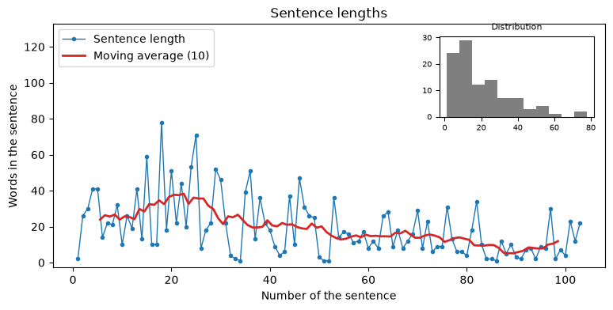

# Sentence lengths

!!! info ""
    **ests.visualizers.sentence_lengths_plot()**, **ests.visualizers.sentence_lengths()**

## Description

The curve of the lengths of the sentences - the rhythm of a text: the length of every sentence in words in order, the moving average over a window of `window` sentences and an inset with the histogram of the lengths. Short and long sentences in turn are an editorial sign of a lively text, a flat curve - of a monotonous one. `sentence_lengths` extracts the lengths: the sentences of a string come from [`SentsExtractor`](../extractors/sentences.md) by the same rules - the inverted marks, the dashes of a dialogue, the abbreviations - and a word belongs to the sentence it starts in; the sentences of a `Doc` come from its boundaries (without them, from its text); ready lengths - any sequence of integers, a numpy array and a Series included - are used as they are; sentences without words are skipped. The function takes the axes `ax` and returns `Axes`.

## Parameters

| Parameter | Type | Default | Description |
| :-------: | :--: | :-----: | :---------: |
| `source` | str/Doc/Iterable[int] | `-` | Text, Doc object or lengths of the sentences (a list, a numpy array, a Series) |
| `window` | int | `10` | Window of the moving average in sentences |
| `inset` | bool | `True` | Show the inset with the histogram |
| `ax` | Axes | `None` | Axes for the plot |

## Usage example

The second window of 2000 words of *Niebla* by Unamuno from the [corpus of literature](../datasets/spanishliterature.md); a window is cut by words, so it opens with the end of a sentence.

!!! example "Example"

    _Code_:

    ``` python
    from ests.corpus import split_windows
    from ests.datasets import SpanishLiterature
    from ests.visualizers import sentence_lengths, sentence_lengths_plot

    sl = SpanishLiterature()
    sl.download()
    text = next(
        record["text"] for record in sl.get_records(author="unamuno") if record["title"] == "Niebla"
    )
    chapter = split_windows(text, 2000)[1]

    sentence_lengths(chapter)[:5]
    # [2, 26, 30, 41, 41]

    sentence_lengths_plot(chapter, window=10)
    ```

    _Result_:

    {: .center }
