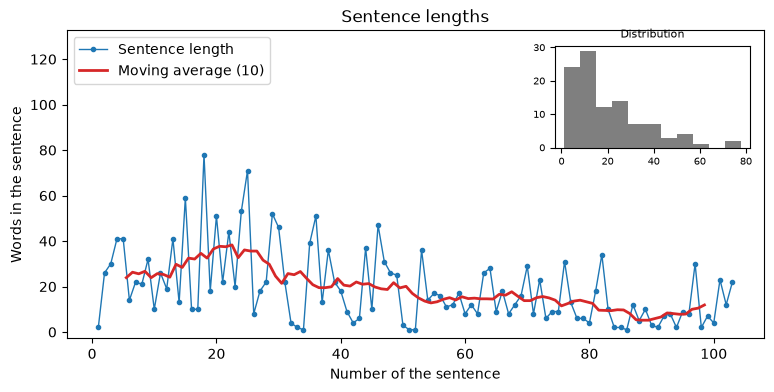

# Sentence lengths

!!! info ""
    **ests.visualizers.sentence_lengths_plot()**, **ests.visualizers.sentence_lengths()**

## Description

--8<-- "visualizers/sentences.md:sentence_lengths_plot"

`sentence_lengths(source, sents_extractor=None, words_extractor=None)` extracts the lengths: a string is split into sentences by the sentence extractor and every sentence into words by the word extractor; the sentences of a `Doc` come from its boundaries and its words from its tokens, punctuation and symbols left out, while a `Doc` without boundaries is counted as its text, by the extractors; sentences without words are skipped. Ready lengths - a sequence or an iterator of integers that are not negative - are used as they are; a table, a set, a mapping, bytes or a length that is not an integer raise `SourceTypeError`, a negative length `SourceError`.

The functions are those of the [anyTS](https://sergeyshk.github.io/anyTS/visualizers/sentences/) core; for a string esTS passes its Spanish [`SentsExtractor`](../extractors/sentences.md) and [`WordsExtractor`](../extractors/words.md) by default, and the `sents_extractor` and `words_extractor` parameters replace them. The default labels are the English ones of `VISUALIZER_LABELS` in `anyts.constants`; `labels` replaces any of them.

## Parameters

--8<-- "visualizers/sentences.md:sentence_lengths_plot-parameters"

## Usage example

The second window of 2000 words of *Niebla* by Unamuno from the [corpus of literature](../datasets/spanishliterature.md); a window is cut by words, so it opens with the end of a sentence.

!!! example "Example"

    _Code_:

    ``` python
    from ests.corpus import split_windows
    from ests.datasets import SpanishLiterature
    from ests.visualizers import sentence_lengths, sentence_lengths_plot

    sl = SpanishLiterature()
    sl.download()
    text = next(
        record["text"] for record in sl.get_records(author="unamuno") if record["title"] == "Niebla"
    )
    chapter = split_windows(text, 2000)[1]

    sentence_lengths(chapter)[:5]
    # [2, 26, 30, 41, 41]

    sentence_lengths_plot(chapter, window=10)
    ```

    _Result_:

    {: .center }
