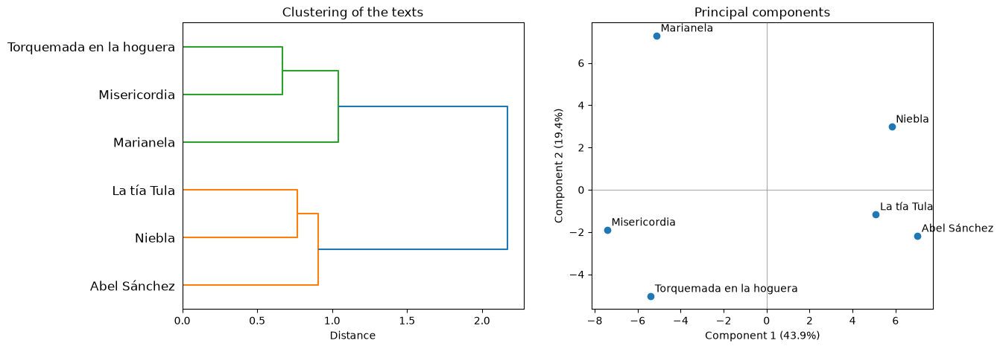
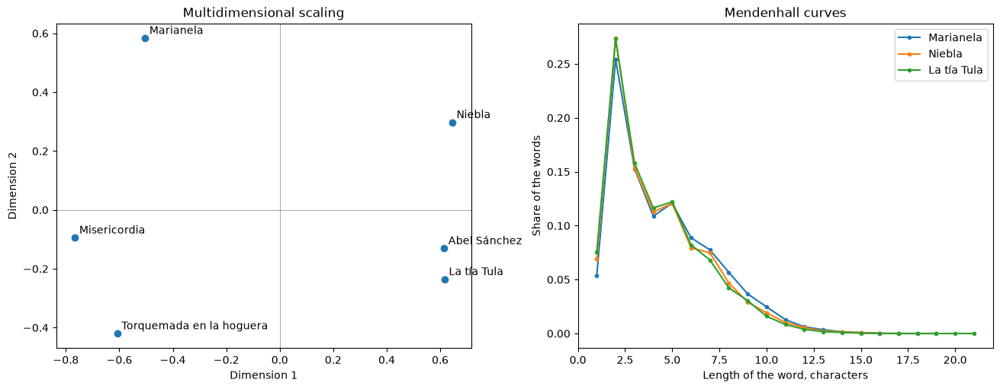

# Stylometric plots

!!! info ""
    **ests.visualizers.dendrogram_plot()**, **ests.visualizers.pca_plot()**, **ests.visualizers.mds_plot()**, **ests.visualizers.mendenhall_plot()**

## Description

Plots for [stylometry](../corpus/stylometry.md): a dendrogram and the multidimensional scaling of the matrix of distances of [`delta`](../corpus/stylometry.md#delta), the principal components of the frequencies of the most frequent words and the Mendenhall curves of several texts - the set stylo uses to look at how texts cluster by author. The functions take the axes `ax` and return `Axes`.

## Dendrogram { #dendrogram_plot }

Hierarchical clustering by `scipy.cluster.hierarchy` over the matrix of distances between texts; Ward's method by default, as in stylo and in [Evert et al. (2015)](https://aclanthology.org/W15-0709.pdf), the labels of the leaves are the names of the texts of the index of the matrix.

| Parameter | Type | Default | Description |
| :-------: | :--: | :-----: | :---------: |
| `distances` | DataFrame | `-` | Symmetric matrix of distances with the names of the texts |
| `method` | str | `ward` | Method of `scipy.cluster.hierarchy.linkage` to join the clusters |
| `ax` | Axes | `None` | Axes for the plot |

## Principal components { #pca_plot }

Principal component analysis of the z-scores of the relative frequencies of the most frequent units ([`frequency_table`](../corpus/stylometry.md#delta), `z_scores`) through the singular value decomposition, as `pca.visualization` of stylo: the texts on the plane of the first two components with their names, the shares of the explained variance in the labels of the axes.

| Parameter | Type | Default | Description |
| :-------: | :--: | :-----: | :---------: |
| `corpus` | dict[str, list[str]] | `-` | Units of the texts by the names of the texts |
| `n_mfw` | int | `100` | Number of the most frequent units; `None` - all of them |
| `culling` | float | `0.0` | Smallest share of the texts a unit occurs in |
| `ax` | Axes | `None` | Axes for the plot |

## Multidimensional scaling { #mds_plot }

Classical multidimensional scaling (Torgerson 1952) of any matrix of distances: the double centering of the matrix of squared distances and the two leading eigenvectors; the distances between the points approximate the distances of the matrix.

| Parameter | Type | Default | Description |
| :-------: | :--: | :-----: | :---------: |
| `distances` | DataFrame | `-` | Symmetric matrix of distances with the names of the texts |
| `ax` | Axes | `None` | Axes for the plot |

## Mendenhall curves { #mendenhall_plot }

The shares of the words by length in characters ([`mendenhall_curve`](../corpus/stylometry.md#mendenhall)) of every text on one plot - a comparison of the profiles of authors. A curve runs over every length from one to the longest word of its text, and a length that no word has is drawn at zero.

| Parameter | Type | Default | Description |
| :-------: | :--: | :-----: | :---------: |
| `corpus` | dict[str, list[str]] | `-` | Words of the texts by the names of the texts |
| `ax` | Axes | `None` | Axes for the plot |

## Usage example

Six novels from the [corpus of literature](../datasets/spanishliterature.md), three by Galdós and three by Unamuno.

!!! example "Example"

    _Code_:

    ``` python
    import matplotlib.pyplot as plt

    from ests import WordsExtractor
    from ests.corpus import delta
    from ests.datasets import SpanishLiterature
    from ests.visualizers import dendrogram_plot, mds_plot, mendenhall_plot, pca_plot

    sl = SpanishLiterature()
    sl.download()
    titles = (
        "Marianela",
        "Misericordia",
        "Torquemada en la hoguera",
        "Niebla",
        "Abel Sánchez",
        "La tía Tula",
    )
    novels = {
        record["title"]: record["text"]
        for author in ("galdos", "unamuno")
        for record in sl.get_records(author=author)
        if record["title"] in titles
    }
    we = WordsExtractor(lowercase=True)
    corpus = {title: we.extract(novels[title]) for title in titles}
    distances = delta(corpus, n_mfw=100, variant="cosine")

    # Dendrogram and principal components on one figure
    fig, (left, right) = plt.subplots(1, 2, figsize=(13, 5))
    dendrogram_plot(distances, ax=left)
    pca_plot(corpus, n_mfw=100, ax=right)

    # Multidimensional scaling and Mendenhall curves
    fig, (left, right) = plt.subplots(1, 2, figsize=(13, 5), layout="constrained")
    mds_plot(distances, ax=left)
    mendenhall_plot(
        {title: corpus[title] for title in ("Marianela", "Niebla", "La tía Tula")}, ax=right
    )
    ```

    _Result_:

    {: .center }

    {: .center }

Cosine Delta over the 100 most frequent words separates the authors: the dendrogram joins the novels of each author before it joins the two groups, and the first principal component, 43.9% of the variance, puts Galdós on one side and Unamuno on the other. The Mendenhall curves hardly differ - word length is a weak feature on its own.
