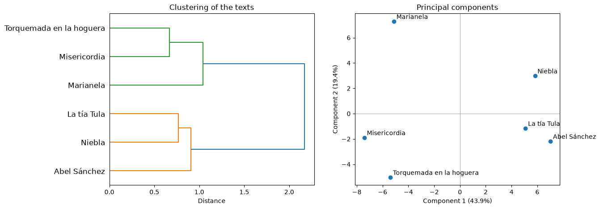
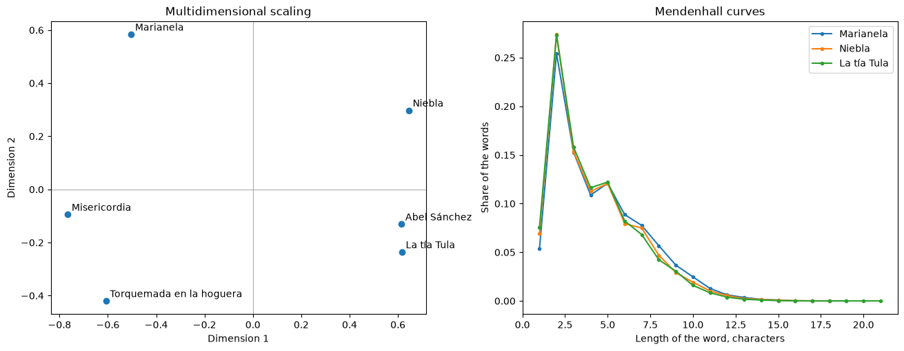

# Stylometric plots

!!! info ""
    **ests.visualizers.dendrogram_plot()**, **ests.visualizers.pca_plot()**, **ests.visualizers.mds_plot()**, **ests.visualizers.mendenhall_plot()**

## Description

Plots for [stylometry](../corpus/stylometry.md): a dendrogram and the multidimensional scaling of the matrix of distances of [`delta`](../corpus/stylometry.md#delta), the principal components of the frequencies of the most frequent words and the Mendenhall curves of several texts. The functions take the axes `ax` and return `Axes`.

The functions are those of the [anyTS](https://sergeyshk.github.io/anyTS/visualizers/stylometry/) core; the frequencies of the principal components come from [`frequency_table`](../corpus/stylometry.md#delta) and the curves from [`mendenhall_curve`](../corpus/stylometry.md#mendenhall). The default labels are the English ones of `VISUALIZER_LABELS` in `anyts.constants`; `labels` replaces any of them.

## Dendrogram { #dendrogram_plot }

--8<-- "visualizers/stylometry.md:dendrogram_plot"

## Principal components { #pca_plot }

--8<-- "visualizers/stylometry.md:pca_plot"

## Multidimensional scaling { #mds_plot }

--8<-- "visualizers/stylometry.md:mds_plot"

## Mendenhall curves { #mendenhall_plot }

--8<-- "visualizers/stylometry.md:mendenhall_plot"

## Usage example

Six novels from the [corpus of literature](../datasets/spanishliterature.md), three by Galdós and three by Unamuno.

!!! example "Example"

    _Code_:

    ``` python
    import matplotlib.pyplot as plt

    from ests import WordsExtractor
    from ests.corpus import delta
    from ests.datasets import SpanishLiterature
    from ests.visualizers import dendrogram_plot, mds_plot, mendenhall_plot, pca_plot

    sl = SpanishLiterature()
    sl.download()
    titles = (
        "Marianela",
        "Misericordia",
        "Torquemada en la hoguera",
        "Niebla",
        "Abel Sánchez",
        "La tía Tula",
    )
    novels = {
        record["title"]: record["text"]
        for author in ("galdos", "unamuno")
        for record in sl.get_records(author=author)
        if record["title"] in titles
    }
    we = WordsExtractor(lowercase=True)
    corpus = {title: we.extract(novels[title]) for title in titles}
    distances = delta(corpus, n_mfw=100, variant="cosine")

    # Dendrogram and principal components on one figure
    fig, (left, right) = plt.subplots(1, 2, figsize=(13, 5))
    dendrogram_plot(distances, ax=left)
    pca_plot(corpus, n_mfw=100, ax=right)

    # Multidimensional scaling and Mendenhall curves
    fig, (left, right) = plt.subplots(1, 2, figsize=(13, 5), layout="constrained")
    mds_plot(distances, ax=left)
    mendenhall_plot(
        {title: corpus[title] for title in ("Marianela", "Niebla", "La tía Tula")}, ax=right
    )
    ```

    _Result_:

    {: .center }

    {: .center }

Cosine Delta over the 100 most frequent words separates the authors: the dendrogram joins the novels of each author before it joins the two groups, and the first principal component puts Galdós on one side and Unamuno on the other. The Mendenhall curves hardly differ - word length is a weak feature on its own.
