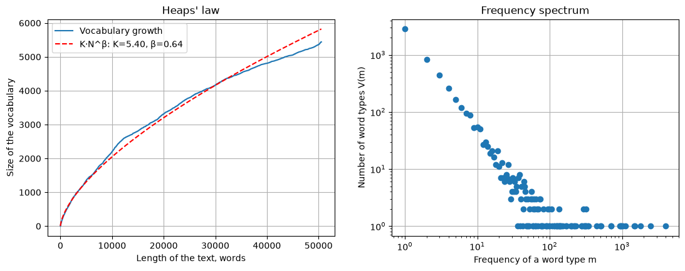

# Crecimiento del vocabulario y espectro de frecuencias

!!! info ""
    **ests.visualizers.heaps_plot()**, **ests.visualizers.frequency_spectrum_plot()**

## Descripción

Dos gráficos de la distribución de las palabras de un texto que completan la [ley de Zipf](zipf.md): el crecimiento del vocabulario con la longitud del texto según la ley de Heaps y el espectro de frecuencias, cuántos tipos de palabra aparecen exactamente una, dos, tres veces. Ambos gráficos están en zipfR (`plot.vgc`, `plot.spc`). Las funciones reciben los ejes `ax` y devuelven `Axes`.

## Ley de Heaps { #heaps_plot }

El tamaño del vocabulario $V$ tras cada palabra del texto y la curva ajustada $V(N) = K \cdot N^{\beta}$ de [`fit_heaps`](../stats/diversity_stats_funcs.md#heaps_beta) con sus parámetros en la leyenda. En corpus de millones de palabras $\beta$ ronda 0.4-0.6; sobre la curva entera de un solo texto sale más alto, 0.6-0.9, porque al principio de un texto casi cada palabra es nueva; la curva depende del orden de las palabras.

| Parámetro | Tipo | Por defecto | Descripción |
| :-------: | :--: | :---------: | :---------: |
| `words` | list[str] | `-` | Palabras del texto en orden |
| `ax` | Axes | `None` | Ejes para el gráfico |

## Espectro de frecuencias { #frequency_spectrum_plot }

El número de tipos de palabra $V(m)$ que aparecen exactamente $m$ veces ([`calc_frequency_spectrum`](../stats/diversity_stats_funcs.md#frequency_spectrum)) en coordenadas logarítmicas; el borde izquierdo son los hápax. El espectro está en la base de las medidas de diversidad de Yule, Sichel, Michéa y Honoré, y su forma muestra lo lejos que está el vocabulario del texto de agotarse.

| Parámetro | Tipo | Por defecto | Descripción |
| :-------: | :--: | :---------: | :---------: |
| `words` | list[str] | `-` | Palabras del texto |
| `ax` | Axes | `None` | Ejes para el gráfico |

## Ejemplo de uso

Los lemas de *Marianela* de Galdós de [Project Gutenberg](https://www.gutenberg.org).

!!! example "Ejemplo"

    _Código_:

    ``` python
    from urllib.request import urlopen

    import matplotlib.pyplot as plt

    from ests import WordsExtractor
    from ests.visualizers import frequency_spectrum_plot, heaps_plot

    url = "https://www.gutenberg.org/cache/epub/17340/pg17340.txt"
    text = urlopen(url).read().decode("utf-8")
    text = text[text.index("\n", text.index("*** START OF")) : text.index("*** END OF")]
    lemmas = WordsExtractor(use_lexemes=True, lowercase=True, filter_nums=True).extract(text)

    fig, (left, right) = plt.subplots(1, 2, figsize=(13, 4.5))
    heaps_plot(lemmas, ax=left)
    frequency_spectrum_plot(lemmas, ax=right)
    ```

    _Resultado_:

    {: .center }
