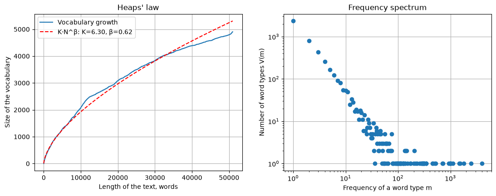

# Crecimiento del vocabulario y espectro de frecuencias

!!! info ""
    **ests.visualizers.heaps_plot()**, **ests.visualizers.frequency_spectrum_plot()**

## Descripción

Dos gráficos de la distribución de las palabras de un texto que completan la [ley de Zipf](zipf.md): el crecimiento del vocabulario con la longitud del texto según la ley de Heaps y el espectro de frecuencias, cuántos tipos de palabra aparecen exactamente una, dos, tres veces. Las funciones reciben los ejes `ax` y devuelven `Axes`.

Las funciones son las del núcleo [anyTS](https://sergeyshk.github.io/anyTS/visualizers/vocabulary/); el ajuste de la ley de Heaps se describe en [`fit_heaps`](../stats/diversity_stats_funcs.md#heaps_beta) y el espectro en [`calc_frequency_spectrum`](../stats/diversity_stats_funcs.md#frequency_spectrum). Las etiquetas por defecto son las inglesas de `VISUALIZER_LABELS` en `anyts.constants`; `labels` sustituye cualquiera de ellas.

## Ley de Heaps { #heaps_plot }

<!-- core: visualizers/vocabulary.md:heaps_plot a5a763e -->
El tamaño del vocabulario $V$ tras cada palabra del texto y la curva ajustada $V(N) = K \cdot N^{\beta}$ de `fit_heaps` con sus parámetros en la leyenda; la curva depende del orden de las palabras.

| Parámetro | Tipo | Por defecto | Descripción |
| :-------: | :--: | :---------: | :---------: |
| `words` | list[str] | `-` | Palabras del texto en orden |
| `ax` | Axes | `None` | Ejes para el gráfico |
| `labels` | dict[str, str] | `None` | Etiquetas sobre las de por defecto: `title`, `xlabel`, `ylabel`, `growth` (la curva), `fit` (una cadena de formato con `k` y `beta`) |

## Espectro de frecuencias { #frequency_spectrum_plot }

<!-- core: visualizers/vocabulary.md:frequency_spectrum_plot 22fd438 -->
El número de tipos de palabra $V(m)$ que aparecen exactamente $m$ veces (`calc_frequency_spectrum`) en coordenadas logarítmicas; el borde izquierdo son los hápax. El espectro está en la base de las medidas de diversidad de Yule, Sichel, Michéa y Honoré, y su forma muestra lo lejos que está el vocabulario del texto de agotarse.

| Parámetro | Tipo | Por defecto | Descripción |
| :-------: | :--: | :---------: | :---------: |
| `words` | list[str] | `-` | Palabras del texto |
| `ax` | Axes | `None` | Ejes para el gráfico |
| `labels` | dict[str, str] | `None` | Etiquetas sobre las de por defecto: `title`, `xlabel`, `ylabel` |

## Ejemplo de uso

Los lemas de *Marianela* de Galdós del [corpus de literatura](../datasets/spanishliterature.md).

!!! example "Ejemplo"

    _Código_:

    ``` python
    import matplotlib.pyplot as plt

    from ests import WordsExtractor
    from ests.datasets import SpanishLiterature
    from ests.visualizers import frequency_spectrum_plot, heaps_plot

    sl = SpanishLiterature()
    sl.download()
    text = next(
        record["text"] for record in sl.get_records(author="galdos") if record["title"] == "Marianela"
    )
    lemmas = WordsExtractor(use_lexemes=True, lowercase=True, filter_nums=True).extract(text)

    fig, (left, right) = plt.subplots(1, 2, figsize=(13, 4.5))
    heaps_plot(lemmas, ax=left)
    frequency_spectrum_plot(lemmas, ax=right)
    ```

    _Resultado_:

    {: .center }
