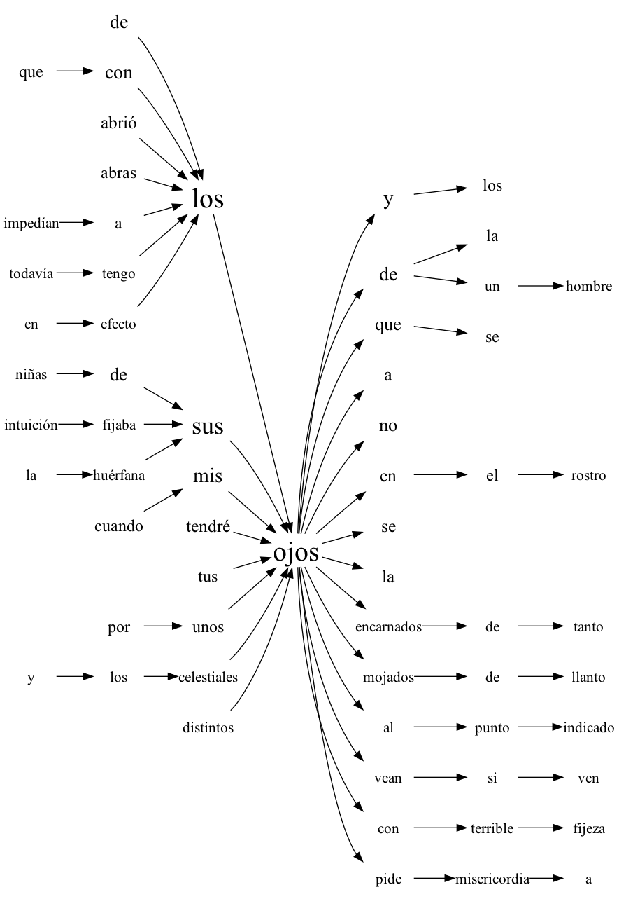

# Word tree

!!! info ""
    **ests.visualizers.wordtree()**

## Description

Building a [word tree](https://www.weblyzard.com/word-tree/) that shows the contexts of a keyword in a text: the N-grams of up to `max_n` words that start or end with the keyword are counted in every list of words - a sentence, for instance - the most frequent `max_per_n` of every size on each side are kept and joined into two trees, the words after the keyword and before it, with the size of the font by frequency.

!!! note "Note"
    The word tree is described in detail in this [paper](https://www.cg.tuwien.ac.at/courses/InfoVis/HallOfFame/2011/Gruppe05/Homepage/Paper/wordtree-paper-wattenberg.pdf).

## Parameters

| Parameter | Type | Default | Description |
| :-------: | :--: | :-----: | :---------: |
| `texts` | list[list[str]] | `-` | List of lists of words |
| `keyword` | str | `-` | Keyword whose contexts are shown |
| `max_n` | int | `5` | Largest size of the context |
| `max_per_n` | int | `8` | Largest number of examples for every size of the context |
| `**kwargs` | - | `-` | Drawing parameters: `max_font_size` (default `30`), `min_font_size` (`12`), `font_interp` - a function interpolating the size of the font from the frequency |

The function returns a `Digraph` of graphviz.

## Usage example

The sentences of *Marianela* by Galdós from [Project Gutenberg](https://www.gutenberg.org).

!!! example "Example"

    _Code_:

    ``` python
    from urllib.request import urlopen

    from ests import SentsExtractor, WordsExtractor
    from ests.visualizers import wordtree

    url = "https://www.gutenberg.org/cache/epub/17340/pg17340.txt"
    text = urlopen(url).read().decode("utf-8")
    text = text[text.index("\n", text.index("*** START OF")) : text.index("*** END OF")]

    we = WordsExtractor(lowercase=True)
    sentences = [we.extract(sentence) for sentence in SentsExtractor().extract(text)]
    graph = wordtree(sentences, "ojos", max_n=4)
    graph.render("wordtree", format="png")
    ```

    _Result_:

    {: .center }

!!! warning "Warning"
    Rendering the tree needs the executables of [Graphviz](https://graphviz.org/download/).
