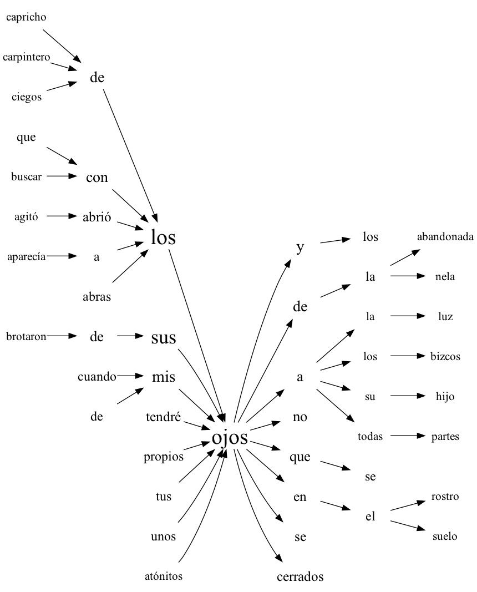

# Word tree

!!! info ""
    **ests.visualizers.wordtree()**

## Description

--8<-- "visualizers/word_tree.md:wordtree"

The function is that of the [anyTS](https://sergeyshk.github.io/anyTS/visualizers/word_tree/) core.

## Parameters

--8<-- "visualizers/word_tree.md:wordtree-parameters"

## Usage example

The sentences of *Marianela* by Galdós from the [corpus of literature](../datasets/spanishliterature.md).

!!! example "Example"

    _Code_:

    ``` python
    from ests import SentsExtractor, WordsExtractor
    from ests.datasets import SpanishLiterature
    from ests.visualizers import wordtree

    sl = SpanishLiterature()
    sl.download()
    text = next(
        record["text"] for record in sl.get_records(author="galdos") if record["title"] == "Marianela"
    )

    we = WordsExtractor(lowercase=True)
    sentences = [we.extract(sentence) for sentence in SentsExtractor().extract(text)]
    graph = wordtree(sentences, "ojos", max_n=4)
    graph.render("wordtree", format="png")
    ```

    _Result_:

    {: .center }
