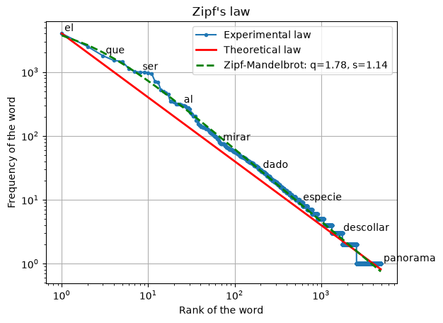

# Zipf's law

!!! info ""
    **ests.visualizers.zipf()**, **ests.visualizers.zipf_theory()**

## Description

Plotting [Zipf's law](https://en.wikipedia.org/wiki/Zipf%27s_law) from a counter of the frequencies of words.

!!! quote "Definition"

    Zipf's law (the rank-frequency law) is an empirical regularity of the distribution of the frequencies of words in a natural language: if all the words of a language, or of a long enough text, are ordered by descending frequency, the frequency of the n-th word of the list is roughly inversely proportional to its number n, the rank of the word. The second most frequent word occurs about half as often as the first, the third a third as often, and so on.

## Parameters

| Parameter | Type | Default | Description |
| :-------: | :--: | :-----: | :---------: |
| `counter` | Counter | `-` | Counter of the frequencies of words |
| `num_words` | int | `None` | Number of the most frequent words |
| `num_labels` | int | `10` | Number of the words labelled on the plot |
| `log` | bool | `True` | Use a logarithmic scale |
| `show_theory` | bool | `False` | Plot the theoretical Zipf's law |
| `alpha` | float | `1.5` | Exponent α of the theoretical Zipf's law, greater than zero |
| `show_fit` | bool | `False` | Plot the Zipf-Mandelbrot fit $f(r) = C / (r + q)^s$ of [`fit_zipf_mandelbrot`](../stats/diversity_stats_funcs.md#fit_zipf_mandelbrot) |
| `ax` | Axes | `None` | Axes of matplotlib for the plot; if not given, a new figure is created |

The function returns the `Axes` with the plot; a `num_words` greater than the number of word types does not extend the curves beyond the data, and an empty counter raises `SourceError`. `zipf_theory(size, num_ranks, alpha, ax)` plots the theoretical curve alone, $f(r) = size \cdot r^{-\alpha}$ for the ranks from 1 to `num_ranks`.

## Usage example

The lemmas of *Marianela* by Galdós from the [corpus of literature](../datasets/spanishliterature.md).

!!! example "Example"

    _Code_:

    ``` python
    from collections import Counter

    from ests import WordsExtractor
    from ests.datasets import SpanishLiterature
    from ests.visualizers import zipf

    sl = SpanishLiterature()
    sl.download()
    text = next(
        record["text"] for record in sl.get_records(author="galdos") if record["title"] == "Marianela"
    )
    counts = Counter(WordsExtractor(use_lexemes=True, lowercase=True, filter_nums=True).extract(text))

    ax = zipf(counts, num_labels=10, show_theory=True, alpha=1.0, show_fit=True)
    ax.figure.savefig("zipf.png")
    ```

    _Result_:

    {: .center }

On logarithmic axes the frequencies of the lemmas fall along a straight line; the Zipf-Mandelbrot fit, $s = 1.14$ with a shift $q = 1.78$, follows them closer than the theoretical law with $\alpha = 1$ at the head of the list.
