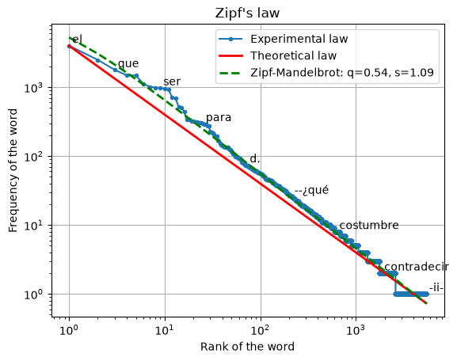

# Zipf's law

!!! info ""
    **ests.visualizers.zipf()**, **ests.visualizers.zipf_theory()**

## Description

--8<-- "visualizers/zipf.md:zipf"

The functions are those of the [anyTS](https://sergeyshk.github.io/anyTS/visualizers/zipf/) core. The default labels are the English ones of `VISUALIZER_LABELS` in `anyts.constants`; `labels` replaces any of them, for instance `labels={"title": "Ley de Zipf"}`.

## Parameters

--8<-- "visualizers/zipf.md:zipf-parameters"

The Zipf-Mandelbrot fit is described in [`fit_zipf_mandelbrot`](../stats/diversity_stats_funcs.md#fit_zipf_mandelbrot).

--8<-- "visualizers/zipf.md:zipf_theory"

## Usage example

The lemmas of *Marianela* by Galdós from the [corpus of literature](../datasets/spanishliterature.md).

!!! example "Example"

    _Code_:

    ``` python
    from collections import Counter

    from ests import WordsExtractor
    from ests.datasets import SpanishLiterature
    from ests.visualizers import zipf

    sl = SpanishLiterature()
    sl.download()
    text = next(
        record["text"] for record in sl.get_records(author="galdos") if record["title"] == "Marianela"
    )
    counts = Counter(WordsExtractor(use_lexemes=True, lowercase=True, filter_nums=True).extract(text))

    ax = zipf(counts, num_labels=10, show_theory=True, alpha=1.0, show_fit=True)
    ax.figure.savefig("zipf.png")
    ```

    _Result_:

    {: .center }

On logarithmic axes the frequencies of the lemmas fall along a straight line; the Zipf-Mandelbrot fit follows them closer than the theoretical law with $\alpha = 1$ at the head of the list.
